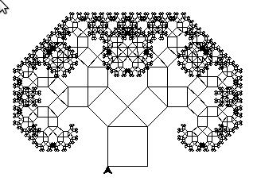
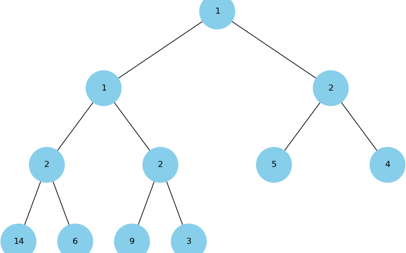
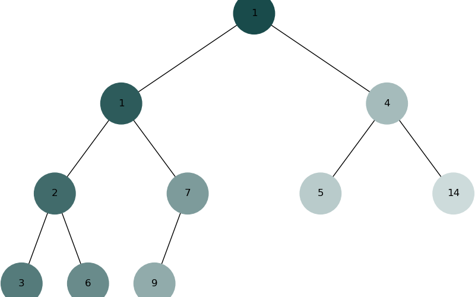
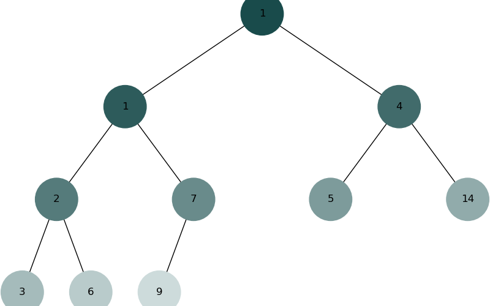

# goit-algo-fp
Фінальний проєкт

## Завдання 1. Структури даних. Сортування. Робота з однозв'язним списком
* task1.py

Приклад виконання:
```
Linked list:
15 -> 10 -> 5 -> 20 -> 25
Reversed linked list:
25 -> 20 -> 5 -> 10 -> 15
Sorted linked list:
5 -> 10 -> 15 -> 20 -> 25
Merge with random sorted list: 14 -> 15 -> 20 -> 21 -> 23
5 -> 10 -> 14 -> 15 -> 15 -> 20 -> 20 -> 21 -> 23 -> 25
```

## Завдання 2. Рекурсія. Створення фрактала “дерево Піфагора” за допомогою рекурсії
* task2.py

Приклад виконання:


## Завдання 3. Дерева, алгоритм Дейкстри
* taks3.py

Приклад виконання:
```
Shortes paths from vertex 'A':
{'A': 0, 'B': 2, 'C': 10, 'D': 4, 'E': 4, 'G': 6, 'L': 13, 'K': 5, 'F': 5, 'I': 5, 'J': 6, 'M': 10}
```

## Завдання 4. Візуалізація піраміди
* task4.py

Приклад виконання:


## Завдання 5. Візуалізація обходу бінарного дерева
* task5.py

Приклад виконання:



## Завдання 6. Жадібні алгоритми та динамічне програмування
* task6.py

Приклад виконання:
```
For buget  30 the Greedy algorithm gives   320 from: ['cola', 'pepsi']
For buget  30 the Dynamic algorithm gives  350 from: ['potato']

For buget  50 the Greedy algorithm gives   670 from: ['cola', 'potato', 'pepsi']
For buget  50 the Dynamic algorithm gives  670 from: ['pepsi', 'potato', 'cola']

For buget 100 the Greedy algorithm gives   870 from: ['cola', 'potato', 'pepsi', 'hot-dog']
For buget 100 the Dynamic algorithm gives  970 from: ['pepsi', 'potato', 'cola', 'pizza']

For buget 150 the Greedy algorithm gives  1120 from: ['cola', 'potato', 'pepsi', 'hot-dog', 'hamburger']
For buget 150 the Dynamic algorithm gives 1220 from: ['pepsi', 'hamburger', 'potato', 'cola', 'pizza']

For buget 200 the Greedy algorithm gives  1420 from: ['cola', 'potato', 'pepsi', 'hot-dog', 'hamburger', 'pizza']
For buget 200 the Dynamic algorithm gives 1420 from: ['pepsi', 'hamburger', 'hot-dog', 'potato', 'cola', 'pizza']
```

## Завдання 7. Використання методу Монте-Карло
* taks7.py

Приклад виконання:
```
Please, enter the count of experiments (in 100k):5
+-----+-------------+
| Sum | Probability |
+-----+-------------+
|  2  |    2.80%    |
|  3  |    5.62%    |
|  4  |    8.32%    |
|  5  |    11.08%   |
|  6  |    13.95%   |
|  7  |    16.64%   |
|  8  |    13.92%   |
|  9  |    11.01%   |
|  10 |    8.36%    |
|  11 |    5.55%    |
|  12 |    2.76%    |
+-----+-------------+
```

### Висновок
Для достатньо великої кількості експерементів (більше за 500 000), метод Монте-Карли наближається до теоретичних значень, що відповідає його базовим властивостям.